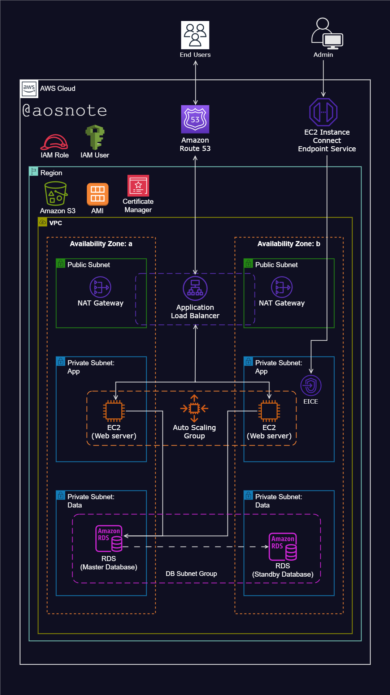

Dynamic Website Hosting on AWS - DevOps Project
This project demonstrates the deployment of a dynamic website on AWS using various AWS resources. The setup ensures high availability, fault tolerance, scalability, and security.

Architecture Overview

Resources Used
Virtual Private Cloud (VPC)

Configured VPC with both public and private subnets spanning two availability zones.
AWS VPC Documentation
Internet Gateway

Deployed an Internet Gateway for connectivity between VPC instances and the wider internet.
AWS Internet Gateway Documentation
Security Groups

Established Security Groups to act as network firewalls.
AWS Security Groups Documentation
Availability Zones

Leveraged two Availability Zones for increased system reliability and fault tolerance.
AWS Regions and Availability Zones
Public Subnets

Used Public Subnets for infrastructure components like the NAT Gateway and Application Load Balancer.
AWS Subnets Documentation
EC2 Instance Connect Endpoint

Implemented EC2 Instance Connect Endpoint for secure connections to assets within both public and private subnets.
AWS EC2 Instance Connect Documentation
Private Subnets

Placed web servers (EC2 instances) within Private Subnets for enhanced security.
AWS Subnets Documentation
NAT Gateway

Allowed instances in both the private application and data subnets to access the internet via the NAT Gateway.
AWS NAT Gateway Documentation
EC2 Instances

Hosted the website on EC2 Instances.
Created an AMI of the EC2 instance hosting the application code.
AWS EC2 Documentation
Application Load Balancer

Used an Application Load Balancer and a target group to distribute web traffic evenly to an Auto Scaling Group of EC2 instances across multiple Availability Zones.
AWS Application Load Balancer Documentation
Auto Scaling Group

Utilized an Auto Scaling Group to automatically manage EC2 instances, ensuring website availability, scalability, fault tolerance, and elasticity.
AWS Auto Scaling Documentation
Certificate Manager

Secured application communications using AWS Certificate Manager.
AWS Certificate Manager Documentation
Simple Notification Service (SNS)

Configured SNS to alert about activities within the Auto Scaling Group.
AWS SNS Documentation
Route 53

Registered a domain name and set up DNS records using Route 53.
AWS Route 53 Documentation
S3

Used S3 to store application code.
AWS S3 Documentation
RDS (MySQL)

Used a MySQL RDS instance to host the application SQL file.
Migrated the file to RDS using Flyway.
Created a snapshot of the RDS instance.
AWS RDS Documentation
IAM Role

Created an IAM role with S3 permissions to download the file stored in S3.
AWS IAM Documentation
Deployment Steps
VPC Configuration

Create a VPC with public and private subnets spanning two availability zones.
Set up route tables and associate them with the respective subnets.
AWS VPC Documentation
Internet Gateway Setup

Attach an Internet Gateway to the VPC and update the route tables to allow internet access.
AWS Internet Gateway Documentation
Security Group Configuration

Create Security Groups to allow required traffic (HTTP/HTTPS for web servers, SSH for management).
AWS Security Groups Documentation
NAT Gateway and Subnets

Deploy a NAT Gateway in a public subnet.
Configure private subnets to use the NAT Gateway for internet access.
AWS NAT Gateway Documentation
EC2 Instances

Launch EC2 instances in private subnets and deploy the website.
Create an AMI of the configured EC2 instance.
AWS EC2 Documentation
Load Balancer and Auto Scaling

Set up an Application Load Balancer in public subnets.
Create a target group and register EC2 instances.
Configure an Auto Scaling Group to manage the EC2 instances.
AWS Application Load Balancer Documentation
AWS Auto Scaling Documentation
Certificate Manager

Use AWS Certificate Manager to create and validate SSL/TLS certificates for secure communication.
AWS Certificate Manager Documentation
SNS Configuration

Set up SNS topics and subscriptions for Auto Scaling Group notifications.
AWS SNS Documentation
Route 53

Register a domain name and configure DNS records to point to the Load Balancer.
AWS Route 53 Documentation
S3 and RDS

Upload application code to S3.
Configure an RDS instance with MySQL and migrate the database using Flyway.
Create an RDS snapshot for backup.
AWS S3 Documentation
AWS RDS Documentation
Flyway Documentation
IAM Role

Create an IAM role with permissions to access S3 and attach it to the necessary instances.
AWS IAM Documentation
Scripts
All deployment scripts and configurations can be found in the GitHub repository. Link to the GitHub Repository

Conclusion
This project showcases a robust and scalable infrastructure setup for hosting a dynamic website on AWS. By leveraging multiple AWS services and best practices, it ensures high availability, fault tolerance, and security for the web application.

References and Helpful Links
AWS Documentation
AWS VPC Documentation
AWS EC2 Documentation
AWS Auto Scaling Documentation
AWS Application Load Balancer Documentation
AWS Certificate Manager Documentation
AWS SNS Documentation
AWS Route 53 Documentation
AWS S3 Documentation
AWS RDS Documentation
Flyway Documentation
